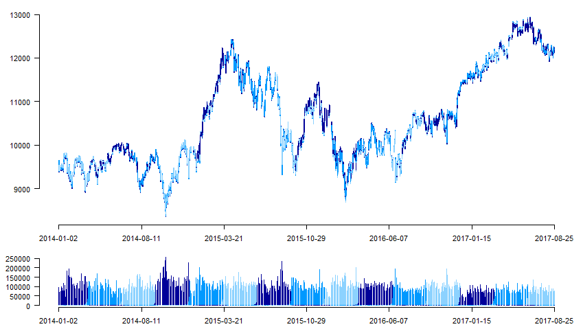

# Use cases for R

## Connect to Athena

In order to connect to Athena we suggest to use a JDBC connection. In order to do so, follow these steps
* Get latest Java version from www.java.com, if not yet available on your machine.
* Install R, if not yet available on your machine ,see https://www.r-project.org/.
* In R, install the libraries "rJava" and "RJBD".
* Start R and load the libraries, with:
```
> library('rJava')
> library('RJDBC')
```
* Set up the driver for Athena with:
```
> athena_drv <- JDBC("com.amazonaws.athena.jdbc.AthenaDriver",
           "C:/Cloud/driver/AthenaJDBC41-1.1.0.jar",
           identifier.quote="'")
```
* Set up the connection with:
```
> athena_connect <- dbConnect(athena_drv, "jdbc:awsathena://athena.eu-west-1.amazonaws.com:443",
							s3_staging_dir="s3://YOURSTAGING_DIRECTORY",
							user= "YOUR_USER",
							password="YOUR_PASSWORD")
```           
* Test the connection with
``` 
> dbListTables(athena_connect)
``` 


## Get data from Athena

Use the dbGetQuery function from the JDBC library to run your own select statements on the public dataset, e.g. like
``` 
> dbGetQuery(athena_connect, "select * from trades limit 10")
``` 

Alternatively, use the exemplary functions provided in the "download_athena.R" file attached and run e.g.:
```
> source('download_athena.R')
> get.future.timeseries.days('FDAX')
> get.future.timeseries.intraday ('FDAX','2017-08-01')
```

## Plot the times series since inception

Load exemplary plotting functions with:
```
> source('graphics_time_series.R')
```
Get the the data for time series since inception with
```
> daybins = get.future.timeseries.days('FDAX')
```
Plot the time series with
```
> eurex.plot.timeseries.days(daybins)
```
R should show the following chart, where the different expiries of the future are shown in different colours.

